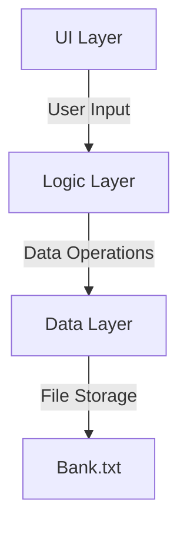

# 🏦 Bank Management System - C++ Console Application  

**A secure and efficient banking system for managing client accounts and financial transactions.**  

---

## 📌 Table of Contents  
- [Features](#-features)  
- [Installation](#-installation)  
- [Usage](#-usage)  
- [System Architecture](#-system-architecture)  
- [Code Structure](#-code-structure)  
- [Screenshots](#-screenshots)  
- [Contributing](#-contributing)  
- [License](#-license)  

---

## ✨ Features  

### 🔐 Account Management  
- **Add/View/Update/Delete** client accounts  
- Secure **PIN code** authentication  
- Unique account number generation  

### 💰 Transaction Processing  
- **Deposit/Withdraw** funds  
- View **total bank balance**  
- Transaction history tracking  

### 📂 Data Persistence  
- **Text-file storage** with custom serialization  
- Data recovery support  
- Efficient data parsing using `#//#` delimiter  

### ✨ Modern & Clean Architecture 
- **Modular codebase** with separation of concerns
  
### 🔧 Powerful Core Features 
- Feature 1, Feature 2, Feature 3
  
### 🎨 Stunning UI Components
- **Responsive design** with dark/light mode support
  
### 📦 Easy Installation 
- **Simple setup** with detailed documentation
  
### 🚀 Performance Optimized
- **Lightning-fast execution** with minimal overhead

---

## 🛠️ Installation  

### Requirements  
- **Compiler**: GCC/G++ (C++17 or later)  
- **Platform**: Windows (for `conio.h` support)  

### Steps  
```bash
# Clone repository (if applicable)
git clone https://github.com/yourusername/bank-system.git
cd bank-system

# Compile the program
g++ main.cpp -o bank_system -std=c++17

# Run the executable
./bank_system
```

---

## 🖥️ Usage  

### Main Menu  
```text
===================================  
       WELCOME TO OUR BANK  
===================================  
[1] Add New Client  
[2] View Client List  
[3] Find Client Data  
[4] Delete Client  
[5] Update Client Data  
[6] Transactions  
[7] Exit  
===================================  
```

### Transaction Submenu  
```text
===================================  
      TRANSACTION MENU SCREEN  
===================================  
[1] Deposit  
[2] Withdraw  
[3] Total Balance  
[4] Back to Main Menu  
===================================  
```

---

## 🏗️ System Architecture  



- **UI Layer**: Console menus and displays  
- **Logic Layer**: Account/transaction processing  
- **Data Layer**: File I/O operations  

---

## 📂 Code Structure  

```plaintext  
bank-system/  
├── main.cpp                 # Main application logic  
├── Bank.txt                 # Client database  
└── README.md                # This documentation  
```  

### Key Functions  
| Function | Description |  
|----------|-------------|  
| `loadClientsFromFile()` | Reads client data from file |  
| `serializeClientData()` | Formats data for storage |  
| `processTransaction()` | Handles financial operations |  
| `inputValidation()` | Validates user input |  

---

## 📸 Screenshots  

**Client Account View**  
```text
------------------------------  
Account Number: ACC1001  
Pin Code: 1234  
Name: John Doe  
Phone Number: +123456789  
Balance: $5000.00  
------------------------------  
```  

---

## 🤝 Contributing  

1. Fork the repository  
2. Create a feature branch (`git checkout -b feature/improvement`)  
3. Commit changes (`git commit -m 'Add new feature'`)  
4. Push to branch (`git push origin feature/improvement`)  
5. Open a Pull Request  

---

## 📜 License  

MIT License  

```text
Copyright (c) 2023 Your Name  
Permission is hereby granted...  
```  

---

**💡 Note**: This is an educational project. For real-world use, implement:  
- Database encryption  
- Secure authentication  
- Audit logging  

--- 

🔄 **Last Updated**: October 2023
